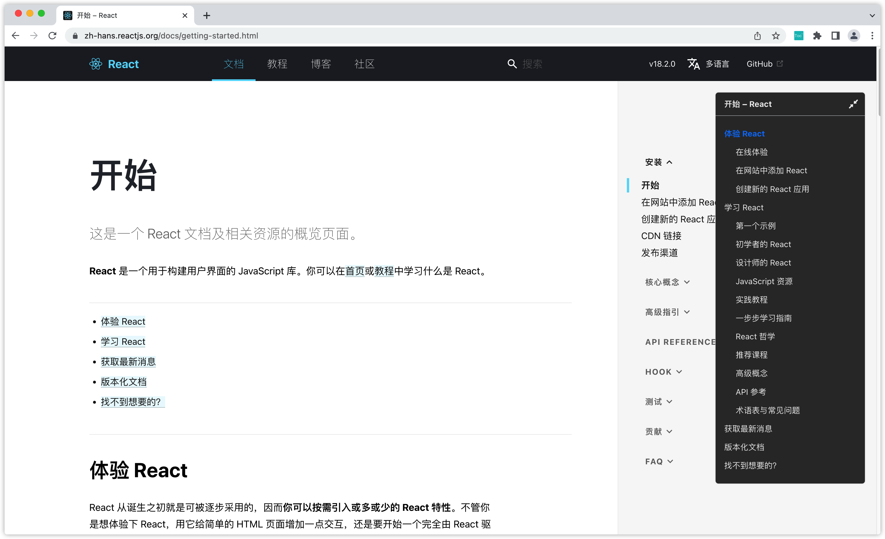

<div align="center">
<h1>OneToc</h1>
<p>Table of content for websites.</p>


</div>

为技术文档、技术博客等网站添加导航目录的浏览器插件，以提供更好的阅读体验。
<br>
Append TOC to the websites such as technical documentation, technical blogs, etc. to provide a better reading experience.



## 如何使用
### Edge
直接到[Edge插件商店](https://microsoftedge.microsoft.com/addons/detail/onetoc/jkgapfniamkoblbmbhdjlnfklihlpjmc)安装即可 

### Chrome
- 下载zip包并解压
- 打开 chrome://extensions/ 页面 
- 点击右上角开启开发者模式 
- 点击左上角加载已解压的扩展程序，选择扩展程序目录即可

## 配置说明
> 选择启用与默认展开、且链接满足匹配规则的页面时，才会生成导航目录。修改配置会立即生效。

### 启用
> 插件的启用和关闭状态，启用才能显示导航目录
- 插件默认启用，打开页面时若链接匹配会往页面添加导航目录
- 插件关闭时，打开页面不会对页面有任何改动

### 默认展开
> 打开新页面时插件的展开和收起状态，展开状态才会完整显示导航目录，收起状态只显示展开按钮
- 插件默认展开，打开新页面或刷新时自动展开
- 关闭默认展开时，打开新页面或刷新时目录自动收起，只显示圆形的展开按钮

### 匹配规则
> 匹配页面链接的规则，符合匹配规则的页面才会显示导航目录
- 匹配规则使用[glob](https://en.wikipedia.org/wiki/Glob_(programming))编写
- 匹配所使用的库是[micromatch](https://github.com/micromatch/micromatch)
- 插件默认的匹配规则如下，可自行修改
- 匹配所有页面可配置为 `**`
```text
*reactjs.org/(docs|blog)/**
*zhihu.com/p/**
*jianshu.com/p/**
*oschina.net/**
*cnblogs.com/**
*csdn.net/**
*github.com/*/**
*eslint.(org|cn)/docs/**
*blog.51cto.com/**
*www.ncbi.nlm.nih.gov/**
```

## 适配情况
### 支持的网站
- 知乎：https://zhuanlan.zhihu.com/p/24650288
- 简书：https://www.jianshu.com/p/a2cb1e3a79be
- 开源中国：https://my.oschina.net/u/4843764/blog/5528481
- React 文档：https://zh-hans.reactjs.org/
- Eslint 文档：https://eslint.org/docs/user-guide/getting-started
  - http://eslint.cn/docs/user-guide/getting-started
- Github：https://github.com/facebook/react
  - 自带目录，默认关闭，点击Readme标题时出现开启按钮
- 博客园：https://www.cnblogs.com/teach/p/16295605.html
  - 自带目录，默认关闭，hover段落标题时出现开启按钮
- CSDN：https://blog.csdn.net/csdnnews/article/details/124880259
  - 自带目录，不是fixed定位
- 51cto：https://blog.51cto.com/harmonyos/5318953
  - 自带目录默认不出现在可视区域，滚动到偏下位置才出现
  - 自带目录部分文章目录点击无法正确跳转：https://blog.51cto.com/pypypy/5318533
- 掘金：https://juejin.cn/post/7076377297623711757
- 思否：https://segmentfault.com/a/1190000041806654
- NCBI：https://www.ncbi.nlm.nih.gov/pmc/articles/PMC6742634/

### 不兼容的网站
- iteye：https://www.iteye.com/blog/zhoumeng87-2531925
  - 标题不使用Heading标签（h2、h3等），无法兼容
- infoq：https://www.infoq.cn/article/BwXyBWmqroBpkrEdvV1l
  - TODO：ajax加载数据，目录渲染不出数据
