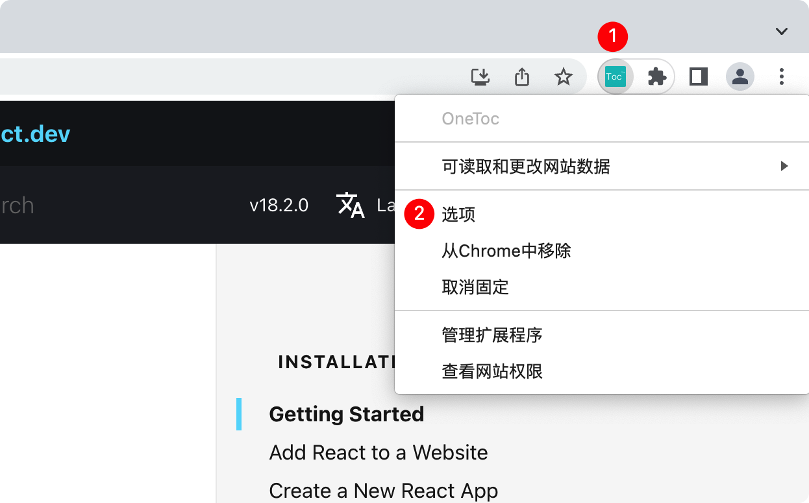

<h1>OneToc</h1>

Table of contents for websites.

为文档、博客、论文等网站添加导航目录的浏览器插件，提供更好的阅读体验。
 
It's a browser extension which can append table of contents to the websites such as docs、 blogs and papers, to provide better reading experience.

## 插件效果

## 特性

- 解析网页中的标题：包括 `H1 ~ H6`、`b`、`strong` 等标签
- 生成多层级导航目录，便于阅读和跳转
- 随页面滚动自动高亮当前标题
- 支持浅色、深色主题
- 支持浮动或内嵌等呈现方式
- 可自由拖拽
- 可自由开关，支持快捷键

## 插件安装

### Edge 浏览器

打开[Edge插件商店](https://microsoftedge.microsoft.com/addons/detail/onetoc/jkgapfniamkoblbmbhdjlnfklihlpjmc)页面，点击获取进行安装

### Chrome 浏览器

- 下载[zip包](https://github.com/Whilconn/one-toc/releases)（注意下载的是包名形式为 OneToc-vx.x.x.zip 的包，不要下载Source Code包）
- 解压到任意目录，如 `~/one-toc/`
- 在浏览器打开 chrome://extensions/ 页面
- 点击页面右上角开启 `开发者模式`
- 点击页面左上角 `加载已解压的扩展程序`，最后选择上述解压目录

## 插件使用
- 安装插件后打开任意网页，如：https://reactjs.org/docs/getting-started.html
- 点击地址栏右侧的 `OneToc` 图标显示目录
- 按下快捷键 `Ctrl+B` 显示目录（Mac `Command+B`，windows/linux `Ctrl+B`）
- 效果参考前文[插件效果](#插件效果)

## 配置说明

右键点击地址栏右侧的 `OneToc` 图标，再点击选项按钮即可打开配置页面，修改配置后点击保存会立即生效。

### 主题

插件提供默认、浅色、深色等3种主题

### 定位

插件提供浮动、嵌入等2种定位

- 浮动定位：默认选项，浮动于内容上方，可能会遮挡网页内容，可自由拖拽
- 嵌入定位：嵌入网页左侧，将网页内容整体右移，不会遮挡网页内容，目前可拖拽

> 嵌入效果与 `vscode` 左侧目录边栏类似，同样使用 `Command+B` 快捷键开启或关闭

### 快捷键
- 显示目录的快捷键默认为 Mac `Command+B`，windows/linux `Ctrl+B`
- 可点击 `去设置` 跳转到快捷键设置页面自行修改

## 适配情况

- 知乎：https://zhuanlan.zhihu.com
- 简书：https://www.jianshu.com
- 开源中国：https://my.oschina.net
- React 文档：https://zh-hans.reactjs.org
- Eslint 文档：https://eslint.org
- Github：https://github.com
- 博客园：https://www.cnblogs.com
- CSDN：https://blog.csdn.net
- 51cto：https://blog.51cto.com
- 掘金：https://juejin.cn
- 思否：https://segmentfault.com
- NCBI：https://www.ncbi.nlm.nih.gov
- 其他...

## 感谢

感谢 JetBrains 提供的开源开发许可证支持！ 

&emsp;&emsp;

## License

[MIT](./LICENSE)

Copyright (c) 2022-present, Whilconn
