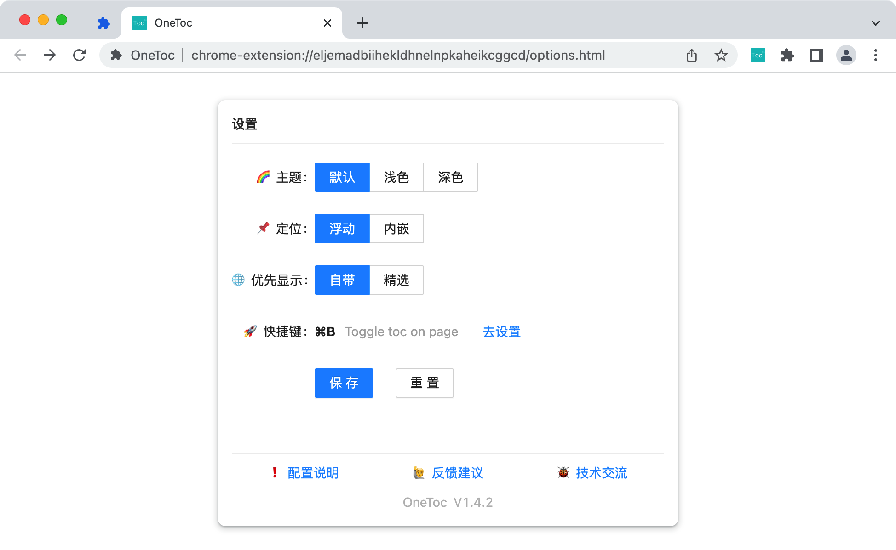

# OneToc

生成网页大纲，提供清晰的结构和便捷的导航，提升阅读体验和效率。适用于新闻、博客、教程、文档、论文等各种网页。

 

Generating a table of contents on web page. Whether it’s news, blogs, tutorials, documents or essays. Providing a clear structure and convenient navigation to help you improve reading experience and efficiency.

## 快速开始

### Edge 浏览器安装

打开[Edge插件商店](https://microsoftedge.microsoft.com/addons/detail/onetoc/jkgapfniamkoblbmbhdjlnfklihlpjmc)页面，点击获取进行安装

### Chrome 浏览器安装

- 下载[zip包](https://github.com/Whilconn/one-toc/releases)（注意下载的是包名形式为 OneToc-vx.x.x.zip 的包，不要下载Source Code包）
- 解压到任意目录，如 `~/one-toc/`
- 在浏览器打开 chrome://extensions/ 页面
- 点击页面右上角开启 `开发者模式`
- 点击页面左上角 `加载已解压的扩展程序`，最后选择上述解压目录

### 使用步骤

- 打开任意网页
- 生成目录：只需要按下快捷键 `Ctrl+B` 或 `Command+B` (Mac)，也可以单击地址栏右侧的 `OneToc` 插件图标
- 页内跳转：点击目录中的任意一个标题，就可以跳转到对应的内容位置

### 效果

## 特性

- 可以反映文档的逻辑层次和内容重点，方便快速浏览全文结构和定位章节、理解文档的主旨和目的
- 可以作为文档的导航工具，提高阅读文档的效率
- 可以提取网页中的标签化标题：包括 `H1 ~ H6`、`b`、`strong` 等 `HTML` 标签
- 可以提取网页中的加粗标题、序号标题
- 提供自带、精选、所有等3种策略的解析结果以供选择
- 点击目录标题可快速跳转到对应内容
- 页面滚动时自动高亮当前目录标题
- 支持多层级目录
- 支持浅色、深色主题
- 支持浮动、内嵌的定位方式
- 支持自由拖拽
- 支持快捷键开关
- 在本地分析网页内容并生成目录，不会收集或上传任何个人信息和浏览数据

## 配置说明

- 1、右键点击地址栏右侧的 `OneToc` 图标
- 2、点击弹出菜单中的选项按钮打开配置页面
- 3、修改配置后点击保存按钮会立即生效

### 主题

插件提供默认、浅色、深色3种主题

### 定位

插件提供浮动、嵌入2种定位方式

- 浮动定位：默认选项，浮动于内容上方，可能会遮挡网页内容，可自由拖拽
- 嵌入定位：嵌入网页左侧，将网页内容整体右移，不会遮挡网页内容，不可拖拽

> 嵌入效果与 `vscode` 左侧目录边栏类似，同样使用 `Command+B` 快捷键开启或关闭

### 优先显示

插件提供自带、精选和所有3种解析策略，可选择优先显示自带或精选。

自带是指网页已标识且符合规范的目录节点，精选是指程序筛选出更优的目录节点，所有则包含了自带、精选以及其他可能的目录节点。

- 自带：默认选项，优先显示自带目录
- 精选：优先显示精选目录

### 快捷键

- 显示目录的快捷键默认为 `Command+B` (Mac) 或 `Ctrl+B` (windows/linux)
- 可点击 `去设置` 跳转到快捷键设置页面自行修改

### 自动打开规则

该配置项可以指定在哪些网页自动显示目录。该配置项是多行文本，每一行是一个匹配规则（必选）和一个毫秒数（可选），二者使用空格隔开。符合匹配规则的页面打开后会自动显示目录，如果配置了毫秒数，则会在页面加载完成后等待若干毫秒再自动显示目录。如果存在多条匹配规则与当前页面链接匹配，只会应用最靠前的那条规则。

匹配规则请使用 [glob](https://en.wikipedia.org/wiki/Glob_(programming)) 编写，源代码中用于匹配的第三方库是 [micromatch](https://github.com/micromatch/micromatch)。

以下是一些匹配规则示例：

- 示例规则1：`**` 匹配所有页面，即打开任意页面都会自动显示目录。
- 示例规则2：`https://zhuanlan.zhihu.com/p/**` 表示匹配所有以 `https://zhuanlan.zhihu.com/p/` 开头的页面，即打开任意以 `https://zhuanlan.zhihu.com/p/` 开头的页面都会自动显示目录。
- 示例规则3：`** 1000` 匹配所有页面并且延迟 `1000ms` 自动显示目录，即打开任意页面 `1000ms` 后都会自动显示目录。延迟配置常用于解决 `Ajax` 加载数据导致解析目录为空的问题，大部分场景不需要。

## 适用范围

目前只支持 `Edge` 和 `Chrome` 浏览器，在绝大部分文字为主的网页上都能使用。

## 感谢

感谢 JetBrains 提供的开源开发许可证支持！ 

&emsp;&emsp;

## License

[MIT](./LICENSE)

Copyright (c) 2022-present, Whilconn
