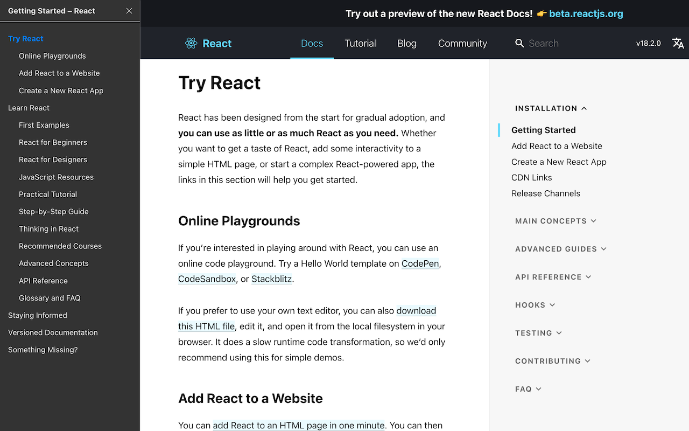

<div align="center">
<h1>OneToc</h1>
<p>Table of contents for websites.</p>


</div>

为技术文档、技术博客等网站添加导航目录的浏览器插件，以提供更好的阅读体验。
<br>
It's a browser extension which can append table of contents to the websites such as technical docs and technical blogs, to provide a better reading experience.



## 感谢
感谢 JetBrains 提供的开源开发许可证支持！<br>


## 如何使用
### Edge
直接到[Edge插件商店](https://microsoftedge.microsoft.com/addons/detail/onetoc/jkgapfniamkoblbmbhdjlnfklihlpjmc)安装即可 

### Chrome
- 下载[zip包](https://github.com/Whilconn/one-toc/releases)并解压
- 打开 chrome://extensions/ 页面 
- 点击右上角开启开发者模式 
- 点击左上角加载已解压的扩展程序，选择扩展程序目录即可

## 配置说明
> 选择开启与默认展开、且页面链接满足匹配规则时，页面才会显示导航目录。修改配置会立即生效。


### 开启和关闭
> 插件可选择开启或关闭两种状态
- 插件默认开启，打开页面显示导航目录
- 插件关闭时，打开页面不显示导航目录

### 主题
> 插件提供默认、浅色、深色等3种主题

### 默认展开
> 打开新页面时插件的显示状态，收起状态只显示展开按钮，展开状态才会完整显示导航目录
- 插件默认展开，打开新页面或刷新时自动展开
- 选中收起时，打开新页面或刷新时目录自动收起，只显示圆形的展开按钮

### 匹配网站
> 插件在哪些网站启用，默认为 `所有` 网站，也可以 `定制`；`定制` 模式下可自行编写匹配规则，符合匹配规则的页面才会显示导航目录
- 匹配规则使用[glob](https://en.wikipedia.org/wiki/Glob_(programming))编写
- 匹配所使用的库是[micromatch](https://github.com/micromatch/micromatch)
- 示例1：匹配所有页面的规则为 `**`
- 示例2：常用的技术网站匹配规则如下
```text
*reactjs.org/(docs|blog)/**
*zhihu.com/p/**
*jianshu.com/p/**
*oschina.net/**
*cnblogs.com/**
*csdn.net/**
*github.com/*/**
*eslint.(org|cn)/docs/**
*blog.51cto.com/**
*www.ncbi.nlm.nih.gov/**
```

## 适配情况
### 支持的网站
- 知乎：https://zhuanlan.zhihu.com
- 简书：https://www.jianshu.com
- 开源中国：https://my.oschina.net
- React 文档：https://zh-hans.reactjs.org
- Eslint 文档：https://eslint.org
- Github：https://github.com
- 博客园：https://www.cnblogs.com
- CSDN：https://blog.csdn.net
- 51cto：https://blog.51cto.com
- 掘金：https://juejin.cn
- 思否：https://segmentfault.com
- NCBI：https://www.ncbi.nlm.nih.gov
